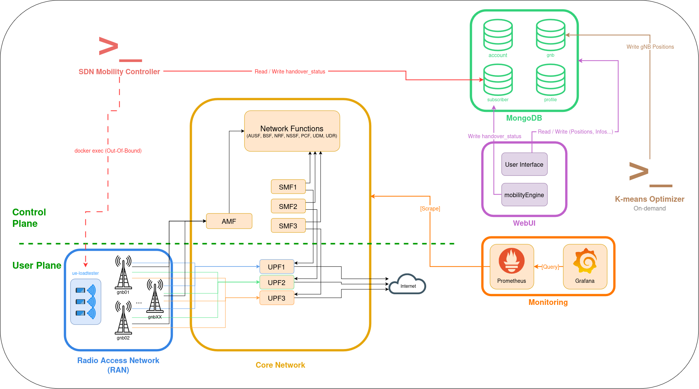

<div align="center">
	<h1>5G Network Deployment Project</h1>
    <br>

[About the project](#about-project) • [Repository Structure](#structure) • [Prerequisites](#prerequisites) • [Getting Started](#getting-started) • [Architecture](#architecture) • [Features](#features) • [Configuration](#configuration) • [Troubleshooting](#troubleshooting) • [Future Work](#contributing)

<br>
</div>

## <a name="about-project"></a> 🌐 About the project

This project simulates a complete 5G network using Open5GS as the core network and UERANSIM to emulate the radio access network (gNBs and UEs). It supports dynamically generating an arbitrary number of gNBs and UEs, simulating UE mobility across the coverage area and automatically re-attaching UEs to their nearest gNB as they move (simulated hard-handover). This project also comes with a K-means-based optimizer to place gNBs where they're most needed, a monitoring stack, a load-test script and a web UI to visualize, control and test the network in real time.

## <a name="structure"></a> 📁 Repository Structure

```
5GPROJECT/
├── compose-files/       # Docker Compose files for each part of the stack
├── config-files/        # Configuration for every network function, template and generated file
│   ├── core/             # Static Open5GS config (AMF, SMF, UPF, UDM, UDR, PCF, NRF, NSSF, AUSF, BSF)
│   ├── gnb/               # gNB templates and dynamically generated configs
│   ├── ue/                # UE config templates
│   └── monitoring/        # Prometheus + Grafana provisioning
├── images/
│   └── webui/             # Dockerfile for the web UI
├── logs/                 # Runtime logs for each core network function
├── scripts/              # All operational scripts, grouped by purpose
│   ├── lifecycle/          # Start/stop/reset the whole stack
│   ├── provisioning/       # Generate gNBs/UEs and seed the database
│   ├── mobility/           # Simulated mobility, handover, gNB placement optimization
│   └── testing/            # Load testing
├── webui/                # Web UI source (see its own README)
└── README.md
```

## <a name="prerequisites"></a> ❗ Prerequisites

- **Docker** and **Docker Compose:** the entire stack (core network, RAN, database, monitoring, web UI) runs as containers, with no other component to install manually.
- **Linux host:** the project has been developed and tested on Linux (containers rely on Linux networking features such as SCTP support in the kernel, used by the AMF/gNB interface). Other OSes may work through Docker Desktop but haven't been tested.
- **Outbound internet access:** on first run, to pull the required container images (Open5GS, UERANSIM, MongoDB, Grafana/Prometheus, the custom WebUI image).
- **Available ports:** make sure the following aren't already in use on the host before starting:
  - the WebUI port (9999)
  - Grafana (3000) and Prometheus (9090) ports (if monitoring is enabled)
  - MongoDB's port (27017), if you plan to access it directly from the host
- **CPU / RAM:** resource usage scales with the number of simulated UEs and gNBs. A handful of UEs runs comfortably on a modern laptop; simulating large numbers (dozens+) will need more CPU headroom, since each UE runs as its own `nr-ue` process.
- **Basic familiarity with Docker:** the setup script handles container orchestration, but reading logs (`docker logs`) and exec'ing into containers (`docker exec`) is useful for troubleshooting.

---

## <a name="getting-started"></a> ➡️ Getting Started

Start by cloning the repository and navigating to the project root:

```bash
git clone https://github.com/GSavatte/5GPROJECT.git
cd 5GPROJECT
```

### Interactive Usage

The entire deployment is driven by a single interactive script, `scripts/lifecycle/start.sh`. Run it from the project root:

```bash
bash scripts/lifecycle/start.sh
```

The script walks you through the deployment step by step. Here's what happens, in order:

**1. Core network startup**
The Open5GS core services are started first: `amf`, `ausf`, `bsf`, `db` (MongoDB), `nrf`, `nssf`, `pcf`, `smf1-3`, `upf1-3`, `udm`, `udr`. Everything else in the stack depends on this being up.

**2. Subscriber & gNB data**
You're asked whether you want to import an existing configuration from the WebUI:
- **Yes** → the WebUI is started immediately (`http://localhost:9999`) so you can import subscribers and gNBs manually. The script then polls MongoDB every few seconds until at least one gNB is found, confirming the import went through.
- **No** → you're prompted for the number of UEs and gNBs to generate (`NB_UES`, `NB_GNBS`). These are passed to the `db-seeder` container, which seeds MongoDB with randomly placed subscribers and gNBs (see [`init_network.js`](./scripts/provisioning/init_network.js)).

**3. gNB config generation & startup**
`scripts/provisioning/start_gnbs.sh` is run (with `sudo`, needed for file permissions on the generated configs) to dynamically generate one config file per gNB plus the corresponding `docker-compose.gnbs.yaml`. The gNB containers are then started from that generated Compose file.

**4. WebUI (if not already running)**
If you didn't import via the WebUI in step 2, you're asked whether to launch it now. It's available at **http://localhost:9999** and lets you manage subscribers, gNBs, and view the live network map.

**5. Monitoring (optional)**
You're asked whether to start the monitoring stack (Prometheus + Grafana). Grafana is available at **http://localhost:3000** (default login: `admin` / `admin`).

**6. UE generation & load testing (optional)**
You're asked how many UEs to include in a load test (`0` to skip). If greater than `0`, an `internet-sim` container is started as a traffic target. In all cases, the `ue-loadtester` container is then started with `NB_UES` and `LOADTEST_COUNT`. This generates and attaches all simulated UEs to their nearest gNB, and optionally runs the load test against `internet-sim`.

**7. SDN mobility controller**
`scripts/mobility/sdn-controller.sh` is launched automatically in the background (its output is logged to `logs/sdn-controller.log`, and its PID is tracked in `shared_flags/sdn-controller.pid`). This controller watches MongoDB for UEs flagged with `handover_status: 'pending'` (set either by the mobility engine as UEs move, or by the [gNB placement optimizer](#features)) and re-attaches them to their target gNB automatically. No manual step or extra terminal is needed.

**8. Redeploy watcher**
Finally, the script enters a foreground loop watching for a redeploy signal (`shared_flags/redeploy.flag`). This file is created by the WebUI when network settings change, and triggers `scripts/lifecycle/re-deploy.sh` automatically without needing to restart everything by hand.

### Non-interactive usage

Every prompt can be skipped by passing its value as a flag:

```bash
bash scripts/lifecycle/start.sh --no-import --nb-gnbs=3 --nb-ues=50 --webui --monitoring --loadtest-count=0
```

| Flag | Skips the prompt for |
|---|---|
| `--rebuild` | (forces a full image rebuild, no prompt involved) |
| `--import` / `--no-import` | Import config from WebUI vs generate via seeder |
| `--nb-gnbs=N` | Number of gNBs to generate |
| `--nb-ues=N` | Number of UEs to generate |
| `--webui` / `--no-webui` | Launch the WebUI |
| `--monitoring` / `--no-monitoring` | Launch Prometheus/Grafana |
| `--loadtest-count=N` | Number of UEs for load testing (`0` = none) |

Any flag left out falls back to an interactive prompt as described above.

> [!IMPORTANT]
> **Keep this terminal open:** the loop running in the foreground is what keeps watching for redeploy signals. To stop the simulation, press `Ctrl+C` and then run `stop.sh` for a clean, complete shutdown.

---

## <a name="architecture"></a> ⚙️ Architecture

We use a microservices architecture, with each network function running in its own container. The core network is based on Open5GS, while the RAN is emulated using UERANSIM. The WebUI and monitoring stack are also containerized, allowing for easy deployment and management.

See the diagram below for a visual representation of the architecture:



> [!NOTE]
> **Architecture Note:** MongoDB acts as a central coordination hub (pedagogical simplification), unlike real 5G distributed interfaces.

> [!NOTE]
> **Handover Note:** Simulated via deregister / reattach (kill process), not real 3GPP session continuity.

## <a name="features"></a> ➕ Features

### Dynamic network generation
Spin up an arbitrary number of gNBs and UEs from a single prompt at startup (`NB_GNBS`, `NB_UES`). Configs, hostnames, and Docker Compose files are generated automatically, no manual editing required (see [`start_gnbs.sh`](./scripts/provisioning/start_gnbs.sh) and [`init_network.js`](./scripts/provisioning/init_network.js)).

### Network slicing
Three independent slices are supported out of the box, each backed by its own SMF/UPF pair (`smf1`/`upf1`, `smf2`/`upf2`, `smf3`/`upf3`), with generated UEs distributed across all three.

### Simulated UE mobility & automatic re-attachment
From the WebUI's map, you can select a UE and a destination point to simulate it moving across the coverage area. Once triggered, the [`mobilityEngine`](./webui/server/mobilityEngine.js) periodically advances the UE toward its destination and compares its distance to its current gNB against the nearest one. When a closer gNB is found (beyond a configurable hysteresis threshold), the UE is flagged in MongoDB (`handover_status: 'pending'`). The [SDN Mobility Controller](./scripts/mobility/sdn-controller.sh) continuously watches for these flags and executes the re-attachment: deregister the UE, kill its `nr-ue` process, rewrite its config to point to the target gNB, and restart it.


> [!NOTE]
> This is a *simulated* re-attachment (deregister → kill the UE process → reconnect with a new config), not a real 3GPP handover. There's no session continuity, so any in-flight traffic (e.g. a ping) is interrupted during the switch. See [Architecture](#architecture) for details.

### On-demand gNB placement optimization
A K-means–based optimizer ([`run_gnb_optimization.sh`](./scripts/mobility/run_gnb_optimization.sh)) can be run at any time to recompute optimal gNB positions based on current UE distribution. Affected UEs are automatically flagged for re-attachment and picked up by the SDN Mobility Controller.

### Web UI
Manage subscribers and gNBs, import/export network configurations, and visualize the live network on an interactive map (see [`webui/`](./webui/README.md)). The map is also where you trigger UE mobility: select a UE and a destination point, and the `mobilityEngine` moves it across the coverage area over time, automatically flagging it for re-attachment to its nearest gNB as it goes (see [Simulated UE mobility](#features) above).

### Monitoring
Optional Prometheus + Grafana stack, scraping metrics from the core network functions, with dashboards available at `http://localhost:3000`. Datasource and dashboards are pre-configured and automatically provisioned on startup, no manual setup needed in Grafana.

### Load testing
Spin up a configurable number of UEs generating real traffic against a simulated internet target (`internet-sim`), to test throughput and core network behavior under load.

---

## <a name="configuration"></a> 🔧 Configuration

Most of the network's behavior can be adjusted without touching any application code.

### Environment variables
The `.env` file at the project root centralizes configuration such as container image versions (Open5GS, MongoDB, Node.js) and tunable runtime parameters (see 	<ins>Mobility parameters</ins> below). The project's scripts read these values to pull the correct container images and set up the stack. Adjusting these values may break compatibility, so only change them if you know what you're doing.

### Core network functions
Every NF's config lives under `config-files/core/` (`amf.yaml`, `smf1.yaml`, `upf1.yaml`, etc.) as standard Open5GS YAML. Edit directly to change things like AMF PLMN/TAC settings, UPF subnet ranges, or SMF session parameters. Changes require restarting the affected container(s).

### gNB and UE templates
`config-files/gnb/templates/gnb-template.yaml` and `config-files/ue/templates/ue-template*.yaml` control what every generated gNB/UE looks like (security keys, integrity/ciphering options, UAC settings, etc.). Placeholders (`GNB_ID_PLACEHOLDER`, `GNB_HOSTNAME_PLACEHOLDER`, `IMSI_PLACEHOLDER`, `GNB_PLACEHOLDER`) are substituted at generation time. Edit the templates to change what applies to *every* generated instance.

### Network slicing
The project ships with three slices by default (`sst: 1/2/3`, each backed by its own SMF/UPF pair), but this isn't fixed:
- **Number/type of slices**: add or remove SMF/UPF pairs in `compose-files/docker-compose.yml` and their corresponding config files in `config-files/core/`, and update the `slices`/`configured-nssai` sections in `config-files/gnb/templates/gnb-template.yaml` so gNBs advertise support for them.
- **Which slice a UE registers on**: set in [`init_network.js`](./scripts/provisioning/init_network.js), where each generated UE is inserted into MongoDB with a `slice` array (`sst`/`sd`). The three UE templates (`ue-template.yaml`, `ue-template2.yaml`, `ue-template3.yaml`) mirror this by each requesting a different `sst` in their `configured-nssai`/`default-nssai`. Adjust both sides to change slice assignment, but keep the subscriber's DB entry and the UE's config in sync, a mismatch causes a `DNN_NOT_SUPPORTED_OR_NOT_SUBSCRIBED` error at session establishment.

### Mobility parameters
`webui/server/mobilityEngine.js` exposes `TICK_RATE` (simulation update interval, in ms) and `HYSTERESIS` (minimum distance improvement required before triggering a re-attachment, to avoid flapping between two nearby gNBs). **Those parameters are set in the `.env` file.** Tune these to make UE movement and handover triggering faster/slower or more/less sensitive.

### Monitoring
Prometheus scrape targets are defined in `config-files/monitoring/prometheus.yml`; Grafana dashboards and datasource provisioning live under `config-files/monitoring/grafana/`.

---

## <a name="troubleshooting"></a> 🔍 Troubleshooting

A few non-obvious issues that came up during development, in case they resurface:

**A UE's `current-cell` in `nr-cli status` doesn't match the gNB I expect**\
This is expected: `current-cell` is a local index (the Nth cell *this UE* has discovered), not the gNB's global NCI. It's not a reliable way to confirm which gNB a UE is attached to. To check for real, look at the UE's own logs (`/tmp/logs-imsi-<...>.txt` inside `ue-loadtester`) or correlate timestamps with the target gNB's logs.

**A UE connects to the wrong gNB after a network restart**\
Check whether `gnbSearchList` in the UE's config uses a raw IP instead of the gNB's DNS hostname (`gnbXX.ueransim.org`). Docker container IPs aren't guaranteed stable across restarts — always resolve by hostname, not by IP resolved once at generation time.

**A UE fails to re-attach with `DNN_NOT_SUPPORTED_OR_NOT_SUBSCRIBED` after a handover**\
The regenerated UE config likely used the wrong slice (`sst`) for that UE. Handovers should only edit `gnbSearchList` in the UE's *existing* config, never regenerate it from a generic template — the original template determines which slice the UE requests, and it must match what's registered for that IMSI in MongoDB.

**A handover keeps repeating in a loop**\
Check that the SDN controller's MongoDB update actually matches a document — the `imsi` field in MongoDB is stored *without* the `imsi-` prefix, while UERANSIM commands and filenames use it *with* the prefix. Mixing the two up means `handover_status` never gets set back to `completed`, so the same UE gets re-flagged forever.

## <a name="contributing"></a> 🤝 Future Work

This project was built as a base platform for further research and experimentation with 5G network simulation, not as a finished product. Feel free to **fork it** and take it in whatever direction is useful to you.

Some ideas for where a fork could go next:
- True session-continuous handover (rather than the current deregister/reattach approach)
- Support for more advanced mobility models
- Horizontal scaling tests with larger UE/gNB counts
- Additional network slicing scenarios